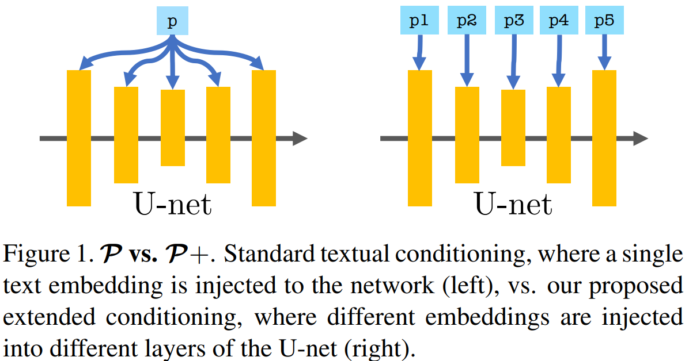

# prompt-plus-pytorch

An unofficial implementation of [P+: Extended Textual Conditioning in Text-to-Image Generation](https://prompt-plus.github.io/) based on [mkshing/prompt-plus-pytorch](https://github.com/mkshing/prompt-plus-pytorch) and [d🧨ffusers](https://github.com/huggingface/diffusers).



## Installation
```commandline
# 1. Clone the repository
git clone https://github.com/SeongMon/prompt-plus
cd prompt-plus

# 2. Create a new conda environment (e.g., named 'prompt-plus')
conda create -n prompt-plus python=3.8

# 3. Activate the conda environment
conda activate prompt-plus

# 4. Upgrade pip
pip install --upgrade pip

# 5. Install project dependencies
pip install -r requirements.txt
```

## Training
```commandline
placeholder_token="mug_skulls"
initializer_token="mug"

accelerate launch train_p_plus.py \
  --pretrained_model_name_or_path="stable-diffusion-v1-5/stable-diffusion-v1-5" \
  --train_data_dir="assets/${placeholder_token}" \
  --learnable_property="object" \
  --placeholder_token="<${placeholder_token}>" --initializer_token=${initializer_token} \
  --resolution=512 \
  --train_batch_size=8 \
  --gradient_accumulation_steps=1 \
  --max_train_steps=500 \
  --learning_rate=5e-3 \
  --lr_scheduler="constant" \
  --lr_warmup_steps=0 \
  --output_dir="output_embeds/${placeholder_token}" \
  --only_save_embeds \
  --report_to "wandb"
```

## Inference

### Prompt Plus
```commandline
placeholder_token="mug_skulls"
output_dir="output_images/${placeholder_token}"
learned_embed="output_embeds/${placeholder_token}"
model_name="stable-diffusion-v1-5/stable-diffusion-v1-5"
seed=42

python inference.py \
  --pretrained_model_name_or_path "$model_name" \
  --learned_embed_name_or_path "$learned_embed" \
  --placeholder_token "<${placeholder_token}>" \
  --task "p+" \
  --float16 \
  --num_images_per_prompt 1 \
  --guidance_scale 7.5 \
  --prompts "scene" \
  --seed $seed \
  --output_dir "${output_dir}"
```

### Style Mixing
```commandline
placeholder_token="mug_skulls"
placeholder_token_2="cat_statue"
output_dir="output_images/${placeholder_token}"
learned_embed="output_embeds/${placeholder_token}"
learned_embed_2="output_embeds/${placeholder_token_2}"
model_name="stable-diffusion-v1-5/stable-diffusion-v1-5"
seed=42

python inference.py \
  --pretrained_model_name_or_path "$model_name" \
  --learned_embed_name_or_path "$learned_embed" \
  --learned_embed_name_or_path_2 "$learned_embed_2" \
  --placeholder_token "<${placeholder_token}>" \
  --task "style_mixing" \
  --mixing_start 5 \
  --mixing_end 8 \
  --float16 \
  --num_images_per_prompt 1 \
  --guidance_scale 7.5 \
  --prompts "train" \
  --seed $seed \
  --output_dir "${output_dir}"
```
In this example:

- `placeholder_token` and `placeholder_token_2` refer to two different learned embeddings.
- **Style mixing** is applied between layers `5` and `7`.
- The active placeholder token (`<mug_skulls>`) is injected into **cross-attention layers** from index 5 through 7.
- The secondary token (`<cat_statue>`) is used for **all other cross-attention layers**.

For **Stable Diffusion v1.5**, there are a total of **16 cross-attention layers**:
- 6 in the **downsampling path** (0~5)
- 1 in the **mid block** (6)
- 9 in the **upsampling path** (7~15)
 
This allows for **fine-grained control** over where each concept is represented, enabling creative compositional blending of styles and content across layers.


## Citation

```bibtex
@article{voynov2023P+,
  title={P+: Extended Textual Conditioning in Text-to-Image Generation},
  author={Voynov, Andrey and Chu, Qinghao and Cohen-Or, Daniel and Aberman, Kfir},
  booktitle={arXiv preprint},
  year={2023},
  url={https://arxiv.org/abs/2303.09522}
} 
```

## Reference
- [diffusers Textual Inversion code](https://github.com/huggingface/diffusers/tree/main/examples/textual_inversion)

---
## ✨ Acknowledgements

- [mkshing/prompt-plus-pytorch](https://github.com/mkshing/prompt-plus-pytorch)
- [huggingface/diffusers](https://github.com/huggingface/diffusers)
---